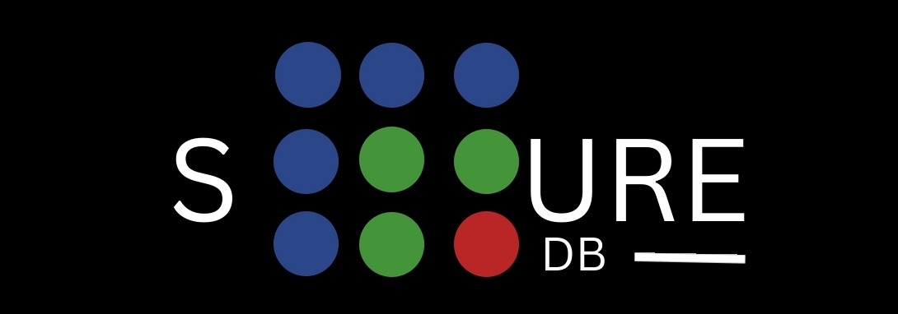

 

> The Software is still under development from our squares programmers!
> But we are pushing the changes under this [repo](https://github.com/square-db/squaredb). You can join us to be a Square too!

    

    SquareDB, a robust database engine crafted in Rust, seamlessly delivers speed and scalability. Elevate its capabilities effortlessly by extending it with lua!

<h3 align="center">Develop easier. &nbsp; Build faster. &nbsp; Like Squares</h3>

 

    
    &nbsp;
    

